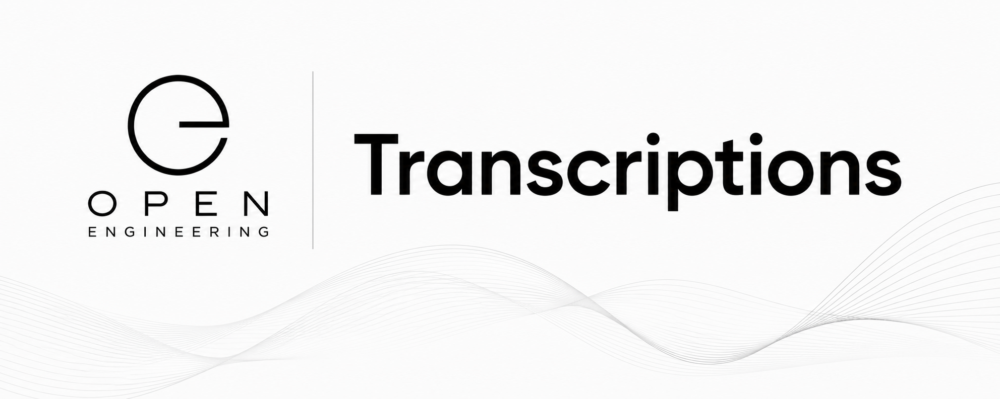

# Open Engineering Transcriptions

Transforming human communication into reusable engineering elements.

Open Engineering Transcriptions is the home of transcription technologies within the Open Engineering ecosystem. It provides a provider-independent abstraction for converting spoken and written human communication into structured engineering artifacts that can be consumed throughout the ecosystem.

Rather than focusing on a particular speech-to-text product or AI vendor, this organization defines the concepts, interfaces, conventions, and implementations that allow any transcription engine to participate in Open Engineering.

Mission

People communicate naturally.

Engineering systems require structured information.

Open Engineering Transcriptions bridges that gap.

Its mission is to transform conversations, meetings, interviews, brainstorming sessions, rehearsals, observations, and voice commands into reusable engineering elements while preserving context, provenance, and traceability.

Position within the Open Engineering Ecosystem

Human Communication
        │
        ├── Speech
        ├── Conversation
        ├── Meeting
        ├── Interview
        ├── Brainstorm
        ├── Observation
        ├── Diary
        ├── Rehearsal
        └── Voice Command
                │
                ▼
Open Engineering Transcriptions
                │
        ├── Speech Recognition
        ├── Speaker Attribution
        ├── Timestamping
        ├── Language Detection
        ├── Normalization
        ├── Enrichment
        └── Metadata Extraction
                │
                ▼
Engineering Elements
                │
        ├── Stories
        ├── Memories
        ├── Observations
        ├── Investigations
        ├── Decisions
        ├── Questions
        ├── Breakdowns
        ├── Schedules
        ├── Timelines
        ├── Character Dialogue
        └── Documentation

What this organization is

Open Engineering Transcriptions is responsible for:

* Defining transcription models and interfaces.
* Converting speech into structured text.
* Normalizing transcripts into consistent engineering formats.
* Preserving timestamps and speaker information.
* Detecting languages.
* Enriching transcripts with metadata.
* Producing reusable engineering elements.
* Supporting multiple transcription providers through a common abstraction.

What this organization is not

This organization is not responsible for:

* Workflow orchestration
* Story generation
* Long-term memory
* AI agents
* Documentation generation
* Production planning

Those responsibilities belong to other Open Engineering organizations.

Relationship to other organizations

Organization	Responsibility
Open Engineering Transcriptions	Human communication → engineering elements
Open Engineering Flows	Orchestrates transcription within workflows
Open Engineering APIs	Integrates external transcription providers
Open Engineering Agent Fabrics	Routes voice and event streams
Open Engineering Memories	Stores transcripts as durable knowledge
Open Engineering Stories	Turns transcripts into narratives
Open Engineering Breakdowns	Extracts production assets from transcripts
Open Engineering Characters	Produces and consumes spoken dialogue

Provider-independent architecture

Open Engineering Transcriptions deliberately separates engineering concepts from vendor implementations.

Possible implementations include:

* OpenAI Speech
* Whisper
* AudioPen
* Apple Dictation
* Deepgram
* AssemblyAI
* Azure AI Speech
* Google Speech-to-Text
* Amazon Transcribe
* ElevenLabs Speech-to-Text

These are implementations—not the architecture.

The engineering interfaces remain stable regardless of which provider is used.

Typical processing pipeline

Human Communication
        │
        ▼
Speech Recognition
        │
        ▼
Normalization
        │
        ▼
Metadata Extraction
        │
        ▼
Engineering Element
        │
        ▼
Markdown / YAML / JSON

Design principles

Open Engineering Transcriptions follows the broader Open Engineering philosophy.

* Provider-agnostic — implementations are interchangeable.
* Element-Oriented — produces reusable engineering elements rather than application-specific outputs.
* Composable — integrates naturally with Stories, Memories, Breakdowns, Flows, and other organizations.
* Traceable — preserves provenance, timestamps, speakers, and confidence information.
* Metadata-first — produces machine-readable outputs suitable for automation.
* Open by Design — encourages reusable interfaces and portable data formats.

Example applications

The same transcription capability can support many engineering scenarios:

* Voice notes
* Engineering meetings
* Product discovery interviews
* Design workshops
* AI conversations
* Daily journals
* Field observations
* Investigation logs
* Magic performance scripting
* Stage rehearsals
* Character dialogue capture
* Voice-controlled engineering systems

Each begins as human communication and becomes structured engineering knowledge.

Vision

Open Engineering Transcriptions establishes a common foundation for transforming human communication into reusable engineering elements.

It enables every Open Engineering application to treat conversations, meetings, observations, and spoken ideas not as disposable recordings, but as structured, traceable, and reusable building blocks that flow seamlessly through the broader Open Engineering ecosystem.
